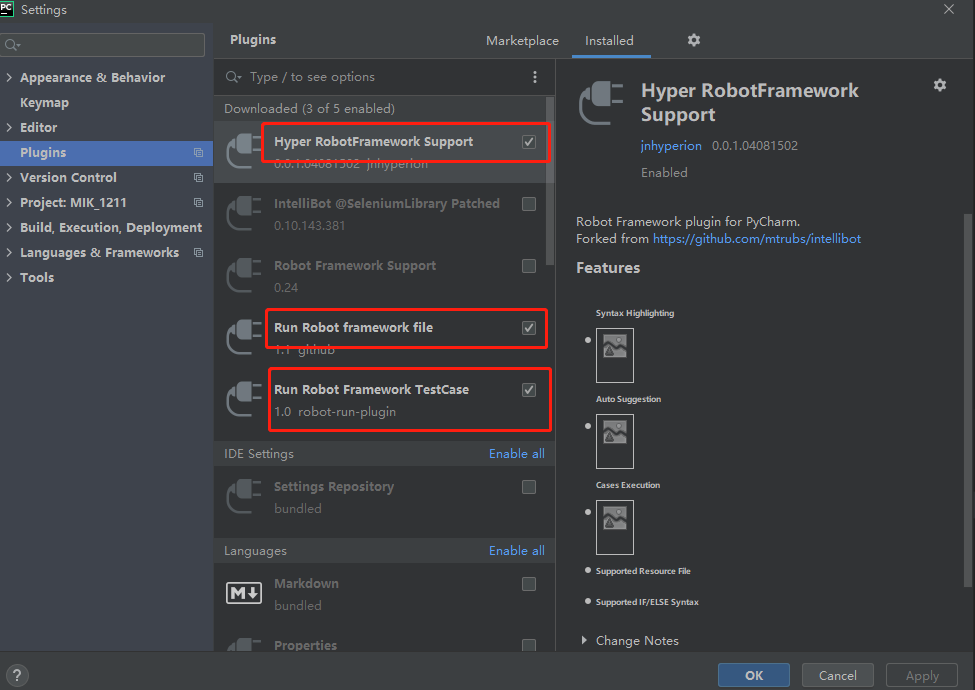
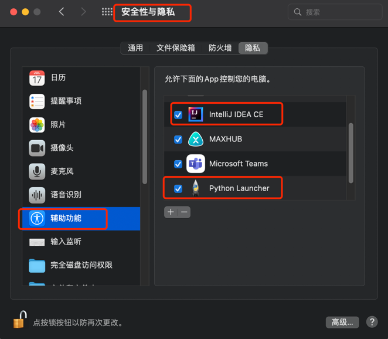

# 操作指引
驱动下载地址： https://chromedriver.chromium.org/home

+ 注意下载版本要与自己的chrome版本相同

  > MAC:    复制到 /usr/local/bin（访达 > 前往 >文件夹）    
    Window： 将文件复制到所用的python下的Scripts文件夹下

+ MAC添加信任    
  > cd /usr/local/bin    
    sudo xattr -d com.apple.quarantine chromedriver    
  > 如果依然提示没有权限    
  > chmod 777 chromedriver
+ 配置阿里云源
  > MAC
  > 在终端进入目录：cd ~/    
  > mac用户目录如果没有 .pip 文件夹，那么就要新建这个文件夹    
  > mkdir .pip     
  > 然后在.pip 文件夹内新建一个文件    
  > vi pip.conf    
  > 编辑 pip.conf 文件，写入阿里云文件  
    >```
    >[global]
    >index-url = http://mirrors.aliyun.com/pypi/simple/
    >[install]
    >trusted-host=mirrors.aliyun.com
    >```
    >Windows下，直接在user目录中创建一个pip目录，C:\Users\xx\pip
    > 新建pip.ini文件
    > ```
    > [global]
    > trusted-host=mirrors.aliyun.com
    > index-url = http://mirrors.aliyun.com/pypi/simple/
   >```
  > 

+ SeleniumLibrary安装
  > python3 -m pip install robotframework-seleniumlibrary  
  > MAC安装失败   
  > sudo python3 -m pip install robotframework-seleniumlibrary

+ SeleniumLibrary文档
  >  RF官网：https://robotframework.org   
  >  WebUI实例：https://github.com/robotframework/SeleniumLibrary    
  >  WebUI文档：https://robotframework.org/SeleniumLibrary/SeleniumLibrary.html

+ GIT配置
  > 获取ssh秘钥： ssh-keygen -t rsa -C "你的邮箱"   
  > git config --global  --list    
  > git config --global  user.name  "你的用户名"   
  > git config --global  user.email "你的邮箱"

+ 开发工具插件安装
+ 
  > 
+ MAC使用键盘或鼠标事件注意事项
> 需要授权idea或pycharm，以及Python Launcher辅助功能权限。   
> 输入法使用英文输入法
> 

+ 关于日期输入问题
> 需要修改系统日期格式为 mm/dd/yyyy，否则日期输入会出错

+ 示例代码块
```
<div id="new-div">
    <button id="trigger" class="css-o5fpxd eoh2u5r5">
        <div class="css-hk4gl8">
            
       </div>
    </button>
    <input type="text" class="s_ipt" name="wd" id="kw" maxlength="100" autocomplete="off">
    <input type="submit" value="百度一下" id="su" class="btn self-btn bg s_btn">
    <input></input>
    <h2 class="css-1ype142">My Shopping Cart is Empty.</h2>
</div>

```
- Xpath语法
  > https://www.runoob.com/xpath/xpath-syntax.html
  >```
  > 匹配全部文本       //h2[text()="My Shopping Cart is Empty."]     
  > 匹配文本开始       //h2[starts-with(text(),"My Shopping Cart")]
  > 匹配文本结束       //h2[ends-with(text(),"Cart is Empty.")]
  > 配置文本包含       //h2[contains(text(),"Shopping Cart")]
  > 匹配属性包含       //input[contains(@id,"su")]
  > 匹配属性          //input[@id="su"]
  > 匹配多个属性       //input[@id="kw" and @name="wd"]
  > 匹配父级          //img[@alt="shopping cart"]/..  或  /parent::*
  > 匹配下一个兄弟节点  //input[@id="su"]/following-sibling::input
  > 匹配上一个兄弟节点  //input[@id="su"]/preceding-sibling::input
  >```
- JQuery语法
  > https://www.runoob.com/jquery/jquery-selectors.html
  > ```
  > 根据id匹配              $("#kw")
  > 根据id匹配input         $("input#kw")
  > 根据name匹配input       $("input[name='wd']")
  > 根据class匹配           $(".s_ipt")
  > 根据id输入文本123        $("#kw").val("123")
  > 清空输入的文体           $("#kw").val("")
  > 获取文本                $("#kw").val()
  > 点击元素                $("#kw").click()
  > ```

- Document语法
  > https://www.runoob.com/jsref/dom-obj-document.html  
  >  ```
  >  document.getElementsByClassName()    返回文档中所有指定类名的元素集合，作为 NodeList 对象
  >  document.getElementById()            返回对拥有指定 id 的第一个对象的引用。
  >  document.getElementsByName()         返回带有指定名称的对象集合。
  >  document.getElementsByTagName()      返回带有指定标签名的对象集合。
  >  ```


+ 项目目录说明
> ```
> 1. 主目录
>   1.1 Keywords
>     1.1.1 CommonKeywords.robot
>     1.1.2 项目名称文件夹
>       1.1.2.1 个人Keywords文件
>   1.2 Libraries
>     1.2.1 CommonLibraries.py
>     1.2.2 项目名称文件夹
>       1.2.2.1 个人Library文件
>  1.3 TestCase
>     1.3.1 demo.robot
>     1.3.2 项目名称文件夹
>       1.3.2.1 个人TestCase文件
>  1.4 TestData
>     1.4.1 envData.robot
>     1.4.2 项目名称文件夹
>       1.4.2.1 个人TestData文件
>  1.5 CaseData
>     1.5.1 项目文件夹
> ```

> End